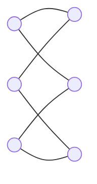

# [模拟赛]高三楼

​		参观完各种饭堂，学校还有什么著名的景点呢？当然是教室了，此时此刻我
们来到了高三楼。你会发现高三楼门口会有以身份认证系统，这东西还有着一段
疼人的历史。
​		每年的九月到来，高三的童鞋大多不习惯学校的作息时间，有人迟到的情况
在所难免，2013 届的moreD 同志作为当年的纪检部部长，创造了一种十分厉
害的身份认证系统。他会给每位童鞋的饭卡加上一个电子认证信息：一个 $n\times n$ 
的矩阵，其中，每行每列都有两个特殊的点。moreD 同志设计的身份认证系统
会把这些矩阵读进来，并且对此进行解析，由于每个同学都带有独特的矩阵，系
统就可以在0.00001s 内认证出童鞋的身份。这样迟到的童鞋被登记的速度就会
加快（刷卡嘛），大家上课的时间就不会耽误了，简单、快捷、方便统计。这一
切都要感谢moreD 神牛。
​		但是，有一个IQ 超高的，经常迟到的童鞋，为了不扣分，他破解了moreD
的身份认证系统，并对自己的认证信息做了更改。moreD 得知这个消息后立即
对此等不良bug 进行改进。
他发现对于一些矩阵，只要把与之“重复”的矩阵取出，假身份认证信息的制造
率会降低很多。
​		“重复”的定义为矩阵 $a$ ，通过任意次行列变换，变成了矩阵 $b$ ，矩阵 $a,b$ 
就视为重复。
​		例如：对于 $3\times 3$ 的矩阵，其中矩阵 $a$  与矩阵 $b$  被视为“重复”矩阵。

moreD 想知道对于一个 $n$，可以有多少种不“重复”的矩阵，来填写不同
学生的信息，moreD 忙着更改身份认证系统，这个艰巨的任务就交给你了,你只
需要输出答案 $\mod 100000007$  的值就可以了，因为高一的学生可没有这么多。

### 输入格式： 

第一行，一个整数 $T$，表示数据组数。

### 输出格式： 

$T$  行，每行一个整数，表示方案数。由于答案可能很大，只需要输出方案数

### 样例输入： 

```
3
2
3
4
```

### 样例输出： 

```
1
1
2
```

### 数据范围： 

对于 $10\%$ 的数据 $N\leq 5$；
对于 $50\%$ 的数据 $N\leq 150$；
对于 $100\%$ 的数据 $T\leq 5$ , $N\leq 2000$ 。


似乎不大可做，我们要发挥丰富的想象，用二分图的思想。我们把行和列抽象成点，类似这样……


~~呃……画得有点……~~

因为每一行，每一列上都有两个点，所以图中每个点都有两条边相连，这样就形成了若干个环。而重复的矩形不管怎么行列交换，抽象成的图还是一个环。（~~感性理解一下~~），不重复的矩形就是抽象成二分图后有多个环的。

那么找不重复的矩形的方案数，就转化成二分图若干个环，同一边的点加起来等于 $n$ 的方案数。

也就是把 $n$ 拆成若干个自然数相加的方案数，因为一个环中至少有 $4$ 个点，所以就是把 $n$ 拆成若干个大于 $2$ 的自然数的方案数。求这个方案数就是完全背包。

~~（反正感性理解就行了）~~

```cpp
#include<cstdio>
using namespace std;
const int Mod=1e8+7;
int T,n,f[2005];
int main(){
    f[0]=1;
    for (int i=2;i<=2000;++i)
        for (int j=i;j<=2000;++j)
            f[j]=(f[j]+f[j-i])%Mod;
    scanf("%d",&T);
    while (T--){
        scanf("%d",&n);
        printf("%d\n",f[n]);
    }
    return 0;
}
```

